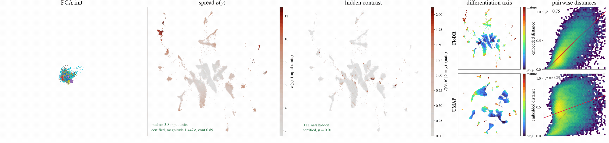

# FloDR

Dimensionality reduction built on an invertible normalising flow. The first
`n_components` output coordinates of the flow are the embedding and the rest are kept as
a residual, so the trained map is a bijection with an exact inverse. The conditional spread
uses that inverse to measure what the layout leaves undetermined at each position. The API
follows the scikit-learn estimator interface. The documentation is at
https://daenuprobst.github.io/flodr/.



## Installation

Python 3.11 or newer.

```bash
pip install flodr
```

For development, install from a clone with the locked dependencies. The tests run on the CPU.

```bash
git clone https://github.com/daenuprobst/flodr
cd flodr
uv sync --extra dev
uv run pytest
```

## Usage

```python
import numpy as np
from flodr import FloDR, viz

X = np.random.default_rng(0).normal(size=(2000, 50)).astype("float32")
labels = (X[:, 0] > 0).astype(int)

model = FloDR(n_components=2, random_state=0).fit(X)
Y = model.embedding_                            # (n, 2)

Y_new = model.transform(X[:10])                 # one forward pass through the flow
Y_opt = model.transform_opt(X[:10])             # per-point placement, UMAP-style
X_back = model.inverse_transform(Y[:10])        # embedding back to input space
Z = model.transform_latent(X[:10])              # layout plus residual
X_same = model.inverse_latent(Z)                # exact to float precision
logp = model.score_samples(X[:10])              # exact log density

sigma = model.conditional_spread()              # what the layout leaves undetermined
field, cert = model.hidden_contrast(labels)     # label structure the layout hides

ax = viz.plot_embedding(Y, labels)
viz.save(ax.figure, "embedding.pdf")
```

Training runs on the GPU whenever CUDA is available; pass `device="cpu"` to force the
CPU. `hidden_contrast` fits a classifier per permutation replica and is by far the
slowest call above.

`FloDR` is a scikit-learn transformer, so it clones, sits in a `Pipeline`, and returns
pandas frames with `set_output(transform="pandas")` (columns `flodr0`, `flodr1`, ...). `score`
is the mean log density per sample, which `GridSearchCV` uses on held-out folds when no
scorer is given. A fitted model pickles with its tensors on the CPU, so a GPU fit loads on a
machine without one. `fit_transform` returns the training layout; inputs under 30 features
carry padding columns that new points do not, so there `transform` on the training data
places points near, not on, `embedding_`.

## Parameters

| Parameter | Default | Description |
|---|---|---|
| `n_components` | `2` | Embedding dimension. Must be at least 2 and below the latent dimension. |
| `w` | `2.0` | Weight of the ordinal term, the local-to-global dial. Higher keeps more global distance. |
| `density` | `True` | Fit the residual density. Required by `score_samples`, `score` and the diagnostics. |
| `max_iter` | `None` | Training steps. `None` keeps the recipe's 6400, see Training budget. |
| `random_state` | `0` | Seed for the fit. `None` draws one. |
| `device` | GPU if there is one | Resolved by `flodr.default_device()`. Pass `"cpu"` to force it. |
| `verbose` | `True` | Draw a tqdm bar while training. |
| `advanced` | `None` | Dict of `TrainConfig` overrides, e.g. `dict(pad=0, fine_eps=0, edge_batch=32768)`. Unknown keys raise. |

## Methods

| Method | Returns | Description |
|---|---|---|
| `fit(X)` / `fit_transform(X)` | self / `(n, k)` | Fit the flow; the layout also lands in `embedding_`. |
| `transform(X)` | `(m, k)` | Embed new points in one forward pass. |
| `transform_opt(X, steps=200, lr=0.05)` | `(m, k)` | Placement transform: per-point optimisation against the frozen train embedding, in the same class as UMAP's `transform`. |
| `inverse_transform(Y)` | `(m, d)` | Decode screen positions, residual set to zero. |
| `transform_latent(X)` | `(m, D)` | Full latent coordinates: the layout, then the residual. |
| `inverse_latent(Z)` | `(m, d)` | Decode full latent coordinates, exactly. |
| `score_samples(X)` | `(m,)` | Log density under the flow. |
| `score(X)` | float | Mean of `score_samples`. |
| `conditional_spread(Y=None, n_samples=64)` | `(m,)` | Spread of the fiber over each position, in input units. |
| `atypicality(n_samples=128)` | `(n,)` | Per-point tail probability under its own fiber, in `[0, 1]`. |
| `spread_calibration(n_bins=14, min_pts=12, n_samples=64)` | dict | Certificate for `conditional_spread`, with `passed` and `confidence`. |
| `hidden_contrast(G, ...)` | `(field, cert)` | Label information present in the input but not in the layout, in nats, against a within-bin permutation null (`n_perm=99` by default). |
| `diagnostics(G=None, **kw)` | dict | Both fields with their certificates, units and labels. |

`fit(X, iters=..., progress=...)` and `inverse_coords(Z)` still work and warn; use
`max_iter`, `verbose` and `inverse_latent`.

## Attributes

| Attribute | Description |
|---|---|
| `embedding_` | `(n, k)` layout of the training data. |
| `n_iter_` | Training steps run. |
| `n_features_in_`, `feature_names_in_` | Input width, and column names when fit on a DataFrame. |
| `roundtrip_` | Max absolute error of the latent round trip. |
| `flow_` | The trained `Flow`. |
| `knn_idx_`, `knn_dist_` | The 15-NN graph the fit was built on. |

## `flodr.viz`

| Function | Description |
|---|---|
| `plot_embedding(Y, labels)` | Scatter of the layout. |
| `plot_field(Y, v)` | One scalar field over the layout. |
| `bivariate_field(Y, x, y)` | Two fields in one panel, with a corner key. |
| `occupancy_field(Y)` | Grid axes and a soft mask of where the layout has data. |
| `depth_fog(Y)` | Draw order, colour weight and depth, for 3D scatters. |
| `residual(flow, X)`, `residual_fraction(flow, X)` | The residual coordinates and their share of the latent norm. |
| `save(fig, path)` | Save at 300 dpi with tight bounds. |
| `RC`, `RC_PAPER` | Matplotlib rc dicts for screen and for print. |

### Training budget

`max_iter=None` runs 6400 steps at a learning rate of 0.0025. Setting it rescales the rate
to keep their product at 16, so `max_iter=1600` runs at 0.01; below 800 steps the rate stays
at 0.02, since larger steps break the inverse (a round trip of 0.16 at 40 steps). Each step
trains on the whole kNN graph up to 262,144 edges and on a random batch of that many above
it, with 48 negatives per edge. Between 50,000 and 500,000 points only the heaviest quarter
of the graph is kept.

Two parts help most on narrow inputs such as a 10-dimensional scVI or scPoli latent. Inputs below
30 dimensions get unit-variance noise columns up to 30 (`pad`), which widen the residual the
layout is routed through; the kNN graph and the ordinal term stay on the input. A shift-only
branch on fixed random frequencies (`fine_eps`, on for every input) joins the couplings that
write the layout halfway through training. `advanced=dict(pad=0, fine_eps=0)` turns both off.

On 250,000 cells of the HNOCA scPoli latent (10 dimensions) recall@15 is 0.134, against
0.102 for UMAP (default parameters, PCA initialisation) and 0.044 for the earlier
recipe, with both certificates passing.
On 103,000 bone marrow cells (PCA-50, no padding) it goes from 0.017 to 0.076. The price is
time: about 6 minutes at 250,000 cells on an RTX 4070 Ti, against under one minute. Every number
in the paper was produced with the earlier recipe (800 steps at 0.02, 12 negatives, no padding).

On CUDA the loss of each step is compiled (`compile_edges`) and its hidden layers run in fp16
with loss scaling (`half_edges="fp16"`), the output layers and the Fourier phase in fp32.
Together they are 2.2x faster than the eager fp32 path at 250,000 and 103,000 cells, at the same
recall and certificates, but no longer bitwise reproducible across runs;
`advanced=dict(compile_edges=False, half_edges="")` restores the eager path. `half_edges="bf16"`
is no faster and loses 2.5 to 3.5% recall.

For new points prefer `transform_opt`. Fit on 200,000 HNOCA cells, 50,000 held-out cells
reach recall@15 0.113 with `transform_opt` in about 6 s, against 0.031 with `transform` and
0.061 for the earlier recipe's `transform_opt`.

`verbose=False` turns the tqdm bar off outright. Left on, it draws only when stderr is a
terminal, so piping to a log does not fill it with carriage returns.

Low-level pieces are exported for custom training: `Flow`, `Coupling`, `TrainConfig`,
`train_flodr`, `raw_recipe`, plus the data helpers `preprocess`, `raw_coords`,
`fuzzy_knn_graph`, `knn_search`, `global_pairs`, `find_ab`.

## Example notebook

`examples/quickstart.ipynb` runs every call above on Fashion-MNIST, 40000 images reduced to
a standardised PCA-50, and takes about four minutes on a GPU. It fits on four fifths of the
images, embeds the rest with both transforms, sweeps `inverse_transform` over a grid of
screen positions to decode the layout back into pictures, and ends on the two diagnostics
with their certificates, both of which pass at that sample size.

## Reproducing the paper

`scripts/regen` rebuilds every figure, table and number of the paper from the released library,
starting from the public data sets. See `scripts/regen/README.md`.
