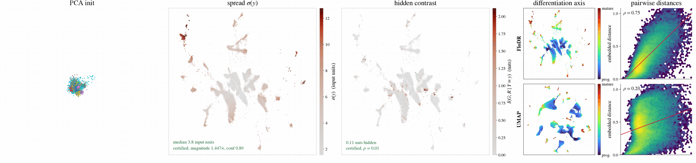

# FloDR

**[Documentation](https://daenuprobst.github.io/flodr/)**

Dimensionality reduction built on an invertible normalising flow. The first `n_components` coordinates of the flow
are the map and the rest are a residual, so the fitted map has an exact inverse and an exact density. FloDR follows
the scikit-learn estimator interface, like UMAP.



## Installation

Python 3.11 or newer. Training uses the GPU when PyTorch sees one.

```bash
pip install flodr
```

## Usage

```python
import matplotlib.pyplot as plt
from flodr import FloDR, audit, viz

model = FloDR(random_state=0).fit(X)
Y = model.embedding_                         # the map

Y_new = model.transform(X_new)               # one pass through the flow
Y_opt = model.transform_opt(X_new)           # optimised against the training map, as UMAP's transform
X_back = model.inverse_transform(Y[:10])     # positions back to the input
Z = model.transform_latent(X_new)            # the map, then the residual
X_same = model.inverse_latent(Z)             # exact up to float precision

logp = model.score_samples(X_new)            # log density
cert = model.coverage_certificate(X_new)     # is the density a law of new points?

res = audit(Y, X=X, labels=labels)           # what the map hides about the labels

fig, ax = plt.subplots(1, 3, figsize=(12, 4))
viz.plot_embedding(Y, labels, ax=ax[0])
viz.plot_ranks([cert["fibre"]["ranks"], cert["map"]["ranks"]], ax=ax[1])
viz.plot_audit(res, axes=ax[2], show_labels=False)
```

| Parameter | Default | |
|---|---|---|
| `n_components` | `2` | dimension of the map |
| `w` | `2.0` | weight of the distance order: 0 keeps neighbourhoods only, larger keeps more global structure |
| `axes` | `"variance"` | start from the leading principal components, or `"heat"` from the heat geometry of the neighbour graph |
| `density` | `True` | fit the density, needed by `score_samples` and the certificates |
| `max_iter` | `None` | training steps, 6,400 by default |
| `random_state` | `0` | seed |
| `device` | `None` | the GPU when there is one |

`examples/quickstart.ipynb` runs these calls on Fashion-MNIST.

## Development

```bash
git clone https://github.com/daenuprobst/flodr
cd flodr
uv sync --extra dev
uv run pytest
```

The documentation is a Starlight site built from `docs/docs/*.md` and the signatures in `src/flodr`:
`cd docs && npm install && npm run dev`.

## Reproducing the paper

`scripts/` holds one script per figure and table of the paper, named after it (`fig2.py`, `ed_table1.py`,
`supp_fig1.py`, ...), and `scripts/common.py` with the data, the methods and the scores they share. Each script fits
what it needs, caches it under `scripts/cache`, so scripts that share fits reuse them, and writes its figure or
table to `scripts/out`.

```bash
uv sync --extra paper
uv pip install git+https://github.com/hyhuang00/ParamRepulsor.git
uv run python scripts/fig2.py
```

Raw data go into `data/` (or the folder named by `DATA`); the data availability statement of the paper lists the
sources, and each script names the files it reads. Three tools need interpreters of their own, named by
`PCUMAP_PYTHON` (Parametric UMAP: TensorFlow 2.15 with umap-learn 0.5.5), `DREAMS_PYTHON` (DREAMS: the authors'
openTSNE fork) and `SCVI_PYTHON` (scvi-tools, for the zebrafish latent); the population-genetics test needs `plink2`.
